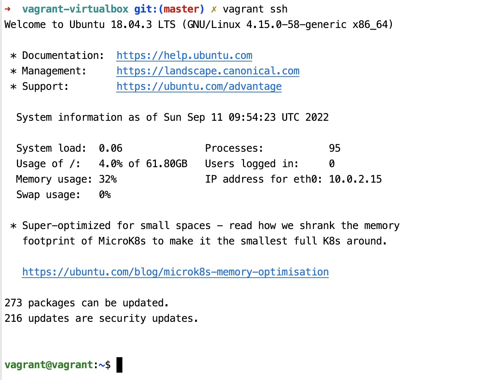
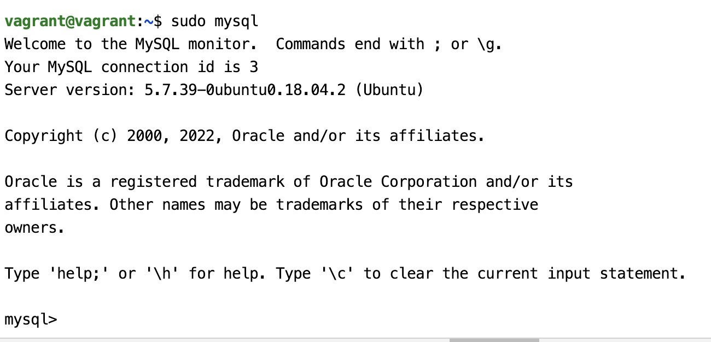

# 快捷启动一个 ubuntu 虚拟机实例

虚拟机是一个比较有意思的事物，有了虚拟机，我们可以轻易在自己电脑上体验不同的操作系统。 Linux 系统
是服务器普遍使用的操作系统，但是很少会是我们个人电脑上的操作系统，那么体验和使用 Linux 就可以使用
虚拟机。Virtualbox 是一款流行的开源免费的虚拟机软件，Prometheus 是一款流行的开源监控软件，MySQL 是
广泛使用的开源数据库软件，如何便捷简单的体验和使用它们，是这篇文章和项目的目的。

如下，只需要 4 个步骤，你就将安装和启动一个 ubuntu 的 virtualbox 虚拟机，里面运行了 mysql 实例和 prometheus
监控系统。

## 开始

1. 手动下载安装 Virtualbox 虚拟机软件 https://www.virtualbox.org/wiki/Downloads
2. 手动下载安装 Vagrant 虚拟机管理软件 https://www.vagrantup.com/downloads
3. 使用 git clone 仓库地址 `https://gitee.com/thunderstorm96/vagrant-virtualbox-prometheus.git`
4. 进入 `vagrant-virtualbox-prometheus` 项目目录,启动虚拟机环境

```bash
# 这条命令首先检查本地是否有 hashicorp/bionic64 的虚拟机镜像 box,如果没有, 则从 vagrantcloud.com 下载该镜像 box
# 下载完成后,将启动该虚拟机
vagrant up
```

恭喜你，通过上述简单 4 个步骤，你已经完成了启动一个安装有 prometheus 和 mysql 实例的 virtualbox 虚拟机。现在
你可以体验很多事情。

## 使用

### 1. 体验 prometheus 监控系统。

   打开 localhost:3001 地址，这是 grafana 前端地址（grafana 用来配合展示 prometheus 监控内容的前端组件） ，默认账号密码 admin/admin. 


   
   登录后，你可以尽情探索。探索完后，可以根据模版id 12633 导入一款 grafana 模版，它展示了 ubuntu 虚拟机的监控状态。

### 2. 登录到 ubuntu 虚拟机，探索 linux

   执行 `vagrant ssh` 连接到虚拟机，执行后，你就进入到了 ubuntu 系统的 shell，可以执行各种 linux 命令， 探索 linux 系统。



### 3. 连接到 mysql 数据库

   虚拟机里安装了一个 mysql 实例，端口 3308，默认已经创建了一个数据库用户 root2/123456, 可以使用你的数据库连接软件连接到数据库。当然，
在使用 `vagrant ssh` 登录到虚拟机 shell 后，你也可以直接执行 `sudo mysql` 连接到 mysql shell。



### 4. 销毁虚拟机

   在体验完后，如果后续不想使用了，自然地，可以销毁、停机、挂起虚拟机，

- 执行 `vagrant destroy`，销毁虚拟机
- 执行 `vagrant halt`，关闭虚拟机
- 执行 `vagrant suspend` 挂起虚拟机

  更多 vagrant cli 命令参考 https://www.vagrantup.com/docs/cli

## 补充说明

运行 `vagrant up` 命令后, vagrant 会根据虚拟机描述文件 `Vagrantfile` 启动一个 virtualbox 虚拟机, 并执行 deploy.sh 脚本. deploy.sh 
脚本将下载和安装 prometheus 和 grafana.

promethues 常用来监控主机、应用、中间件, 通过 agent 来收集主机、应用等的指标信息，汇总保存到时序
数据库，通过 grafana 做前端展示，提供了应用系统的观测性。

### 项目结构

```bash
Vagrantfile # 要启动的虚拟机配置文件
deploy.sh  # 虚拟机启动后运行的脚本：1. 下载安装 prometheus。2. 下载安装 grafana。3. 下载安装 mysql
config/mysqld.cnf  mysqld 配置文件
config/prometheus.yml  prometheus 配置文件
sql/init.sql 创建数据库用户的sql 脚本
```

## 参考

- https://www.vagrantup.com/docs/cli
- https://dev.mysql.com/doc/refman/8.0/en/linux-installation.html

